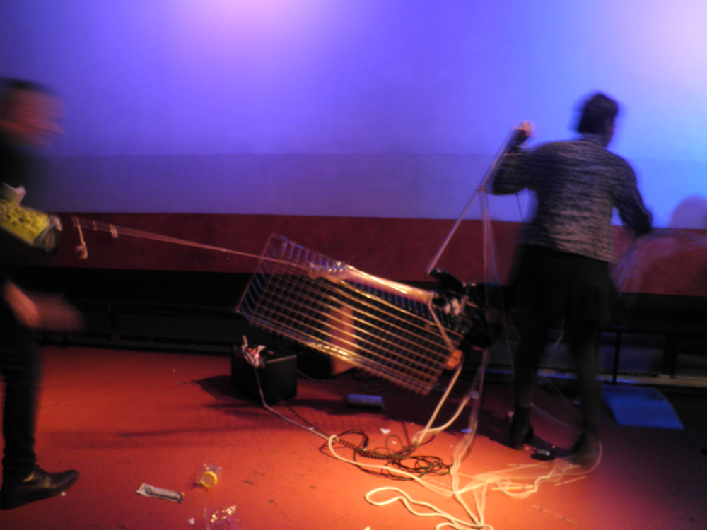

# imissconcerts : a IIIF manifest to annotate and analyze pictures of live noise shows

## First things first : what is noise music?

To say things shortly, noise music is noisy music which calls itself noise. There's no one definition beyond musician's pratices and conceptions, so if you say it's noise, it's noise.

In more detail: noise music is a musical genre that relies heavily on noise (makes sense, right ?) in improvised and often cacophinic pieces. It became established as a genre during the 1980s' and 90s'. Though european musical traditions are essential in its developpment, it grew as an independant genre in the US and in Japan at the same time. In Europe, noise was perceived as a subgenre of other genres before US and Japanese noise exported itself. Noise stems from free improvisation, post-cage experimental music, industrial music, punk and metal. Performances often have a strong performance aspect to them; noise shows and performance art sometimes overlap. In noise culture, DIY is a central value. Instruments are often handmade, repurposed and misused. Small DIY labels are essential to the international distribution of noise music, publishing physical albums in often very limited quantities.

## This manifest contains:
- 9 pictures of noise concerts (both of live performances and setup pictures) uploaded to archive.org
- links to annotations for all pictures
- a search API

## About the data and annotations
- all pictures have been taken by the author, with authorization of the musicians.
- the content of the annotations (including quotes from musicians) is derived of research made for my master's thesis, which focused on noise instrumentation, studied from an ethnomusicological viewpoint.

This IIIF mannifest was created using the IIIF Workbench. Pictures were annoted using the SimpleAnnotationServer, created by the IIIF organization.
